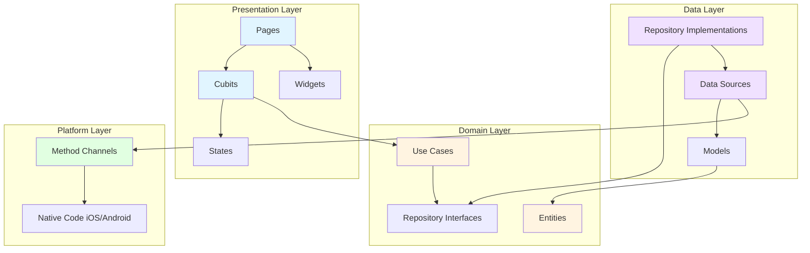
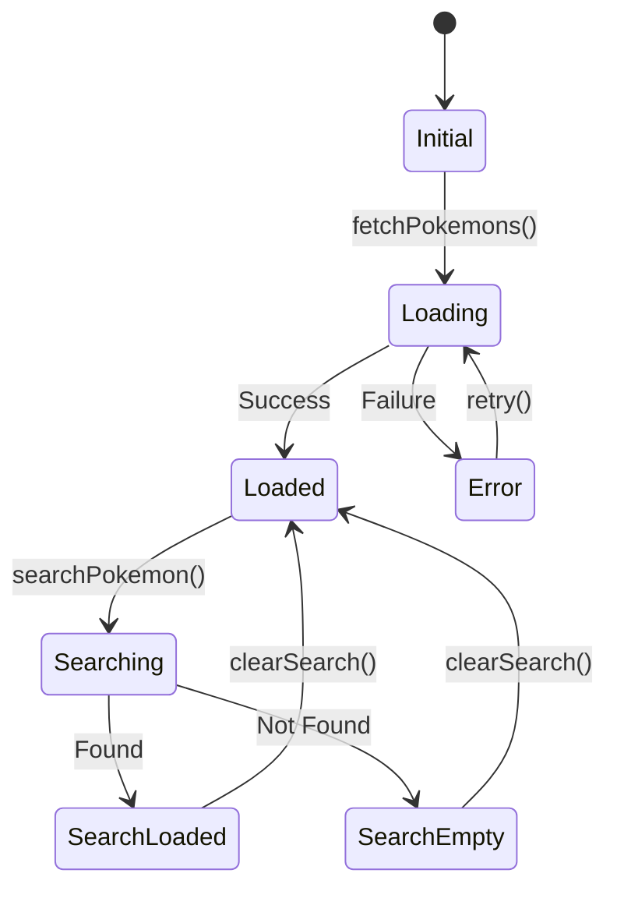
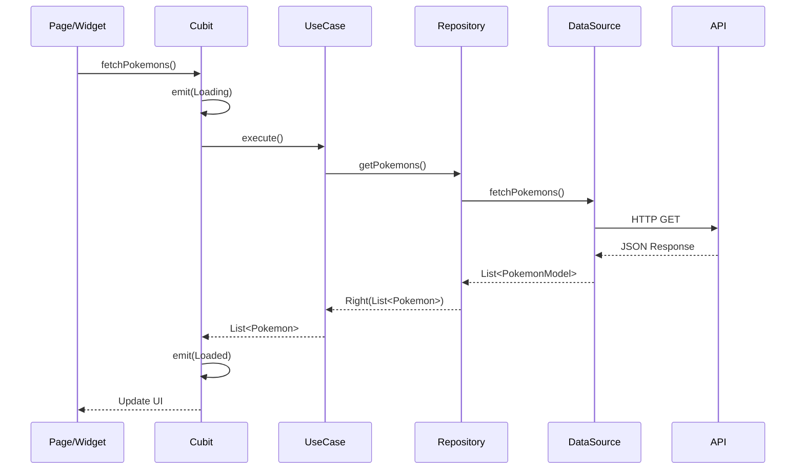
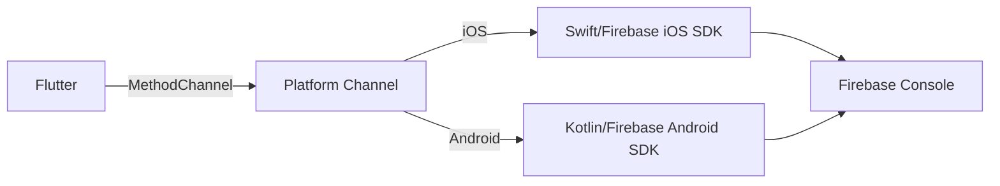

# Pokédex Serasa

Um aplicativo Flutter moderno que consome a API pública do Pokémon GO para listar, buscar e exibir detalhes de pokémons, seguindo os princípios da Clean Architecture e as melhores práticas de desenvolvimento Flutter.

## 📱 Sobre o Projeto

Este projeto foi desenvolvido com foco em demonstrar expertise em:
- Clean Architecture
- Gerenciamento de estado com Cubit/BLoC
- Injeção de dependência com Flutter Modular
- Integração nativa (MethodChannel) com Firebase Analytics
- Testes unitários, de widget e de integração
- Código limpo e manutenível

## ✨ Funcionalidades

- **Listagem de Pokémons**: Visualize todos os pokémons disponíveis em uma grade responsiva
- **Busca Inteligente**: Busque pokémons por nome com feedback em tempo real
- **Filtros Avançados**: Filtre por tipo e ordene alfabeticamente ou por número
- **Detalhes Completos**: Veja informações detalhadas de cada pokémon
- **Cadeia de Evolução**: Visualize e navegue pela cadeia evolutiva dos pokémons
- **Analytics Nativo**: Tracking completo de eventos via Firebase Analytics
- **Tratamento de Erros**: Feedback claro para o usuário em caso de falhas

## 🏗️ Arquitetura

O projeto segue rigorosamente os princípios da **Clean Architecture**, dividindo o código em camadas bem definidas e desacopladas:



### Camadas da Arquitetura

#### 1. **Presentation Layer** (UI + State Management)
Responsável pela interface do usuário e gerenciamento de estados. Utiliza Cubit para orquestrar a lógica de apresentação.

#### 2. **Domain Layer** (Business Logic)
Contém as regras de negócio puras, independentes de frameworks. Define contratos através de interfaces.

#### 3. **Data Layer** (Data Access)
Implementa os repositórios e gerencia as fontes de dados (API, cache, etc.).

#### 4. **Platform Layer** (Native Integration)
Gerencia a comunicação com código nativo via MethodChannel.

## 🎯 Gerenciamento de Estado: Por que Cubit?

### A Escolha do Cubit/BLoC

O **Cubit** foi escolhido como solução de gerenciamento de estado por diversos motivos técnicos e práticos:

#### 1. **Simplicidade e Clareza**
Diferente do BLoC completo que usa eventos e estados, o Cubit expõe métodos diretos, tornando o código mais legível:

```dart
// Cubit - Direto e claro
pokemonsCubit.fetchPokemons();
pokemonsCubit.searchPokemon('pikachu');

// vs BLoC - Mais verboso
pokemonsBloc.add(FetchPokemonsEvent());
pokemonsBloc.add(SearchPokemonEvent('pikachu'));
```

#### 2. **Menos Boilerplate**
Cubit reduz significativamente a quantidade de código necessário, eliminando a camada de eventos:

```dart
class PokemonsCubit extends Cubit<PokemonsState> {
  // Métodos diretos
  void fetchPokemons() async {
    emit(PokemonsLoading());
    // lógica...
  }
}
```

#### 3. **Testabilidade**
Testes com Cubit são mais simples e diretos, sem necessidade de disparar eventos:

```dart
test('should emit loading and loaded states', () {
  whenListen(
    cubit,
    Stream.fromIterable([PokemonsLoading(), PokemonsLoaded(pokemons)]),
  );

  cubit.fetchPokemons();

  expect(cubit.state, PokemonsLoaded(pokemons));
});
```

#### 4. **Rastreabilidade**
Mesmo sem eventos explícitos, o Cubit oferece rastreabilidade completa através do `BlocObserver`:

```dart
class AppBlocObserver extends BlocObserver {
  @override
  void onChange(BlocBase bloc, Change change) {
    super.onChange(bloc, change);
    print('${bloc.runtimeType} $change');
  }
}
```

#### 5. **Performance**
Cubit é mais leve que BLoC completo, ideal para apps mobile onde performance é crítica.

### Fluxo de Estados no App



### Comparação: Cubit vs Outras Soluções

| Critério | Cubit | Provider | GetX | Riverpod |
|----------|-------|----------|------|----------|
| Curva de Aprendizado | ⭐⭐⭐⭐ | ⭐⭐⭐⭐⭐ | ⭐⭐⭐⭐⭐ | ⭐⭐⭐ |
| Boilerplate | Baixo | Médio | Muito Baixo | Médio |
| Testabilidade | ⭐⭐⭐⭐⭐ | ⭐⭐⭐⭐ | ⭐⭐⭐ | ⭐⭐⭐⭐⭐ |
| Rastreabilidade | ⭐⭐⭐⭐⭐ | ⭐⭐⭐ | ⭐⭐ | ⭐⭐⭐⭐ |
| Padrão Arquitetural | ⭐⭐⭐⭐⭐ | ⭐⭐⭐⭐ | ⭐⭐ | ⭐⭐⭐⭐⭐ |
| Comunidade | ⭐⭐⭐⭐⭐ | ⭐⭐⭐⭐⭐ | ⭐⭐⭐⭐ | ⭐⭐⭐⭐ |

**Conclusão**: Cubit oferece o melhor equilíbrio entre simplicidade, testabilidade e aderência aos princípios de Clean Architecture.

## 📊 Fluxo de Dados



## 🗂️ Estrutura de Pastas

```
lib/
├── app/
│   ├── app_module.dart              # Módulo principal do app
│   └── app_widget.dart              # Widget raiz do app
│
├── core/
│   ├── errors/
│   │   ├── failures.dart            # Definições de falhas
│   │   └── exceptions.dart          # Definições de exceções
│   ├── network/
│   │   └── dio_client.dart          # Configuração do cliente HTTP
│   ├── platform/
│   │   └── analytics_channel.dart   # MethodChannel para Analytics
│   ├── theme/
│   │   ├── app_theme.dart           # Tema do aplicativo
│   │   ├── app_colors.dart          # Paleta de cores
│   │   └── app_text_styles.dart     # Estilos de texto
│   ├── utils/
│   │   └── constants.dart           # Constantes globais
│   └── widgets/
│       └── type_badge.dart          # Widget de badge de tipo
│
├── features/
│   ├── analytics/                   # Feature de Analytics
│   │   ├── data/
│   │   │   ├── datasources/
│   │   │   │   └── analytics_datasource.dart
│   │   │   └── repositories/
│   │   │       └── analytics_repository_impl.dart
│   │   ├── domain/
│   │   │   ├── repositories/
│   │   │   │   └── analytics_repository.dart
│   │   │   └── usecases/
│   │   │       ├── log_event_usecase.dart
│   │   │       ├── log_filter_usecase.dart
│   │   │       ├── log_pokemon_view_usecase.dart
│   │   │       ├── log_screen_view_usecase.dart
│   │   │       └── log_search_usecase.dart
│   │   └── presentation/
│   │       └── mixins/
│   │           └── analytics_mixin.dart
│   │
│   ├── pokemons/                    # Feature de listagem
│   │   ├── data/
│   │   │   ├── datasources/
│   │   │   │   └── pokemons_remote_datasource.dart
│   │   │   ├── models/
│   │   │   │   ├── pokemon_model.dart
│   │   │   │   └── pokemons_response_model.dart
│   │   │   └── repositories/
│   │   │       └── pokemons_repository_impl.dart
│   │   ├── domain/
│   │   │   ├── entities/
│   │   │   │   └── pokemon.dart
│   │   │   ├── repositories/
│   │   │   │   └── pokemons_repository.dart
│   │   │   └── usecases/
│   │   │       ├── get_pokemons_usecase.dart
│   │   │       └── search_pokemon_usecase.dart
│   │   └── presentation/
│   │       ├── cubits/
│   │       │   ├── pokemons_cubit.dart
│   │       │   ├── pokemons_state.dart
│   │       │   ├── pokemon_search_cubit.dart
│   │       │   ├── pokemon_search_state.dart
│   │       │   ├── pokemon_filter_cubit.dart
│   │       │   └── pokemon_filter_state.dart
│   │       ├── pages/
│   │       │   └── pokemons_list_page.dart
│   │       └── widgets/
│   │           ├── pokemon_card.dart
│   │           ├── pokemon_header_widget.dart
│   │           ├── pokemons_grid_widget.dart
│   │           └── pokemon_search_widget.dart
│   │
│   ├── pokemon_detail/              # Feature de detalhes
│   │   ├── presentation/
│   │   │   ├── pages/
│   │   │   │   └── pokemon_detail_page.dart
│   │   │   └── widgets/
│   │   │       ├── pokemon_evolution_chain.dart
│   │   │       ├── pokemon_info_section.dart
│   │   │       └── pokemon_wikeness_widget.dart
│   │
│   └── splash/                      # Feature de splash
│       └── presentation/
│           └── pages/
│               └── splash_page.dart
│
└── main.dart                        # Entry point do app

test/
├── core/
│   └── platform/
│       └── analytics_channel_test.dart
├── features/
│   ├── analytics/
│   │   ├── data/
│   │   │   ├── datasources/
│   │   │   │   └── analytics_datasource_test.dart
│   │   │   └── repositories/
│   │   │       └── analytics_repository_impl_test.dart
│   │   └── domain/
│   │       └── usecases/
│   │           ├── log_event_usecase_test.dart
│   │           ├── log_filter_usecase_test.dart
│   │           ├── log_pokemon_view_usecase_test.dart
│   │           ├── log_screen_view_usecase_test.dart
│   │           └── log_search_usecase_test.dart
│   ├── pokemons/
│   │   ├── data/
│   │   │   ├── datasources/
│   │   │   │   └── pokemons_remote_datasource_test.dart
│   │   │   ├── models/
│   │   │   │   └── pokemon_model_test.dart
│   │   │   └── repositories/
│   │   │       └── pokemons_repository_impl_test.dart
│   │   ├── domain/
│   │   │   └── usecases/
│   │   │       ├── get_pokemons_usecase_test.dart
│   │   │       └── search_pokemon_usecase_test.dart
│   │   └── presentation/
│   │       ├── cubits/
│   │       │   ├── pokemons_cubit_test.dart
│   │       │   ├── pokemon_search_cubit_test.dart
│   │       │   └── pokemon_filter_cubit_test.dart
│   │       ├── pages/
│   │       │   └── pokemons_list_page_test.dart
│   │       └── widgets/
│   │           └── pokemon_card_test.dart
│   └── pokemon_detail/
│       └── presentation/
│           └── pages/
│               └── pokemon_detail_page_test.dart
└── helpers/
    └── test_module.dart
```

## 📦 Pacotes Utilizados

### Core Dependencies

#### **dio** (^5.7.0)
Cliente HTTP robusto para Flutter/Dart. Escolhido por:
- Interceptors para logging e tratamento de erros
- Suporte nativo a timeout e retry
- Transformadores de dados integrados
- Melhor performance que http package

#### **flutter_modular** (^6.3.4)
Sistema de injeção de dependência e gerenciamento de rotas. Escolhido por:
- Integração perfeita com Clean Architecture
- Lazy loading de módulos
- Facilita testes com módulos mockados
- Gerenciamento automático do ciclo de vida das dependências

#### **flutter_bloc** (^8.1.6)
Biblioteca de gerenciamento de estado. Escolhido por:
- Padrão testado e aprovado pela comunidade
- BlocProvider e BlocBuilder facilitam integração com UI
- BlocObserver permite logging centralizado
- Excelente para aplicar Clean Architecture

#### **equatable** (^2.0.7)
Facilita comparação de objetos. Escolhido por:
- Simplifica implementação de `==` e `hashCode`
- Essencial para comparação de estados no Cubit
- Reduz boilerplate code
- Melhora performance de rebuilds no Flutter

#### **dartz** (^0.10.1)
Programação funcional para Dart. Escolhido por:
- `Either` para tratamento elegante de erros
- Evita uso excessivo de try-catch
- Torna fluxo de erro explícito
- Padrão comum em Clean Architecture

#### **firebase_core** (^3.8.1) & **firebase_analytics** (^11.3.5)
SDK do Firebase. Escolhido por:
- Analytics robusto e gratuito
- Integração nativa iOS/Android
- Dashboard rico em dados
- Suporte oficial do Google

#### **flutter_svg** (^2.0.17)
Renderização de SVG. Escolhido por:
- Imagens escaláveis sem perda de qualidade
- Menor tamanho de bundle que PNG
- Suporte a cores dinâmicas

### Dev Dependencies

#### **mocktail** (^1.0.4)
Framework de mocking. Escolhido por:
- Syntax mais limpa que mockito
- Não requer geração de código
- Type-safe mocking
- Melhor experiência de desenvolvimento

#### **bloc_test** (^9.1.7)
Testes para BLoC/Cubit. Escolhido por:
- `whenListen` e `blocTest` helpers
- Simplifica testes de estados
- Integração perfeita com flutter_bloc

#### **flutter_test**
Framework de testes do Flutter. Incluso por padrão.

## 🔥 Firebase Analytics

### Implementação Nativa via MethodChannel

O app utiliza Firebase Analytics através de **MethodChannel**, comunicando diretamente com SDKs nativos iOS e Android:



### Eventos Rastreados

1. **screen_view** - Visualização de telas
   - Splash Screen
   - Pokemons List
   - Pokemon Detail

2. **pokemon_view** - Visualização de pokémon específico
   - Parâmetros: `pokemon_name`, `pokemon_id`, `types`

3. **search_performed** - Busca realizada
   - Parâmetros: `query`, `results_count`

4. **filter_applied** - Filtro aplicado
   - Parâmetros: `types`, `sort_by`

### Código Nativo

**iOS (Swift)**
```swift
class AnalyticsMethodChannel: NSObject, FlutterPlugin {
    static func register(with registrar: FlutterPluginRegistrar) {
        let channel = FlutterMethodChannel(
            name: "com.serasa.pokedex/analytics",
            binaryMessenger: registrar.messenger()
        )
        let instance = AnalyticsMethodChannel()
        registrar.addMethodCallDelegate(instance, channel: channel)
    }

    func handle(_ call: FlutterMethodCall, result: @escaping FlutterResult) {
        switch call.method {
        case "logEvent":
            // Implementação...
        case "logScreenView":
            // Implementação...
        }
    }
}
```

**Android (Kotlin)**
```kotlin
class AnalyticsMethodChannel(
    private val firebaseAnalytics: FirebaseAnalytics
) : MethodChannel.MethodCallHandler {

    override fun onMethodCall(call: MethodCall, result: MethodChannel.Result) {
        when (call.method) {
            "logEvent" -> {
                // Implementação...
            }
            "logScreenView" -> {
                // Implementação...
            }
        }
    }
}
```

## 🧪 Testes

O projeto possui **399 testes** com **100% de taxa de sucesso**, cobrindo:

### Testes Unitários
- **Repository**: Verifica chamadas corretas ao datasource
- **Use Cases**: Valida lógica de negócio
- **Cubit**: Testa transições de estado
- **Models**: Valida serialização/deserialização JSON

### Testes de Widget
- **Pokemon List Page**: Listagem, busca, filtros
- **Pokemon Detail Page**: Exibição de detalhes, evoluções
- **Pokemon Card**: Renderização e interações

### Testes de Integração
- **Analytics**: Comunicação com MethodChannel
- **API**: Integração com endpoint real

### Executar Testes

```bash
# Todos os testes
flutter test

# Com coverage
flutter test --coverage

# Testes específicos
flutter test test/features/pokemons/

# Ver relatório de coverage
genhtml coverage/lcov.info -o coverage/html
open coverage/html/index.html
```

## 🚀 Como Executar

### Pré-requisitos

- Flutter SDK ≥ 3.5.4
- Dart SDK ≥ 3.5.4
- iOS 13.0+ (para iOS)
- Android SDK 21+ (para Android)
- Xcode (para iOS)
- Android Studio (para Android)

### Instalação

```bash
# Clone o repositório
git clone https://github.com/John-Rocha/pokedex-serasa.git

# Entre na pasta
cd pokedex-serasa

# Instale as dependências
flutter pub get

# iOS - Instale pods
cd ios && pod install && cd ..

# Execute o app
flutter run
```

### Configurar Firebase (Opcional)

Para habilitar analytics em seu próprio projeto Firebase:

1. Crie um projeto no [Firebase Console](https://console.firebase.google.com/)
2. Baixe os arquivos de configuração:
   - `google-services.json` → `android/app/`
   - `GoogleService-Info.plist` → `ios/Runner/`
3. Execute `flutterfire configure`

## 📈 Melhorias Futuras

- [ ] Implementar cache local com Hive/Sqflite
- [ ] Adicionar favoritos persistentes
- [ ] Modo offline
- [ ] Animações de transição
- [ ] Modo escuro
- [ ] Internacionalização (i18n)
- [ ] Paginação infinita
- [ ] Filtros avançados por stats
- [ ] Comparação entre pokémons

## 🎨 Screenshots

### Lista de Pokémons
Interface responsiva com grid adaptativo mostrando todos os pokémons disponíveis.

### Busca e Filtros
Sistema de busca em tempo real com filtros por tipo e ordenação.

### Detalhes do Pokémon
Visualização completa com informações, fraquezas e cadeia evolutiva interativa.

## 📄 Licença

Este projeto está sob a licença MIT. Veja o arquivo [LICENSE](LICENSE) para mais detalhes.

## 👨‍💻 Autor

**Johnathan Rocha**

Desenvolvedor Flutter apaixonado por criar aplicações móveis robustas e escaláveis, com forte conhecimento em Clean Architecture, gerenciamento de estado e integração nativa.

### 📫 Contato

- **Email**: [johnathanrocha@gmail.com](mailto:johnathanrocha@gmail.com)
- **WhatsApp**: [+55 48 99610-7270](https://wa.me/5548996107270)
- **GitHub**: [@John-Rocha](https://github.com/John-Rocha)
- **LinkedIn**: [/in/johnathan-rocha](https://www.linkedin.com/in/johnathan-rocha/)

---

⭐ Se este projeto foi útil para você, considere dar uma estrela no repositório!

Desenvolvido com ❤️ e Flutter
